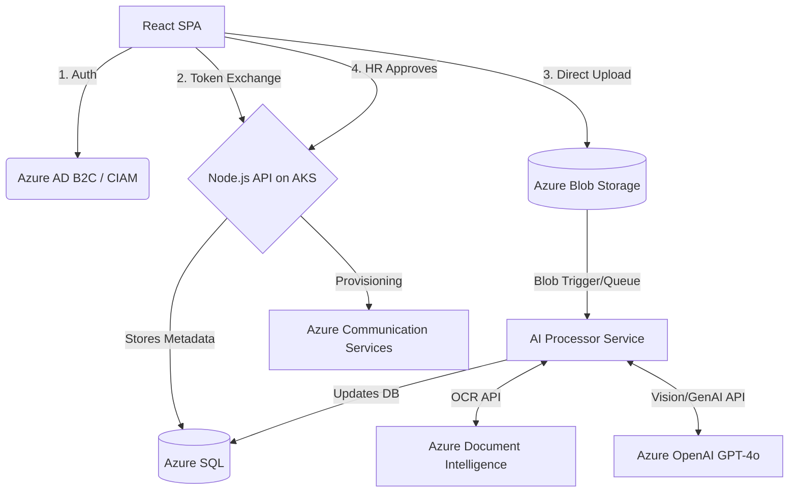

# Project Outline: OnboardIQ

## 1. Project Overview
**Purpose & Problem Statement:**
Traditional employee onboarding is heavily manual, siloed, and error-prone, requiring HR to physically or manually verify documents, coordinate with IT, and track progress over email. OnboardIQ solves this by digitizing the entire onboarding lifecycle through a cloud-native portal. It leverages AI to automatically validate and summarize uploaded documents, providing zero-touch IT provisioning once HR gives final approval. 

**Target Users & Personas:**
- **New Hire:** Self-registers via Enterprise SSO, uploads compliance documents, and tracks onboarding status.
- **HR Reviewer:** Reviews AI-validated documents, requests re-uploads, and approves individual cases.
- **HR Admin:** Oversees the entire onboarding pipeline, manages RBAC teams, and analyzes Power BI metrics.
- **IT Admin:** Monitors the automated zero-touch provisioning queue and manages system access integrations.

**Key Features:**
- Secure, direct-to-cloud document upload via SAS tokens.
- Automated document validation and data extraction using Vision-capable AI (Azure OpenAI GPT-4o) and OCR (Azure Document Intelligence).
- Enterprise Identity integration with Azure AD B2C / Microsoft Entra CIAM.
- Event-driven zero-touch IT provisioning pipeline.
- End-to-end audit logging and cross-verification for enterprise compliance.

---

## 2. System Architecture
**High-Level Architecture & Style:**
OnboardIQ employs a **Cloud-Native, Microservices-oriented** architecture augmented with **Event-Driven Serverless** components. 
- The presentation layer is completely decoupled from the backend. 
- Heavy I/O workloads (like AI processing and IT provisioning) are offloaded to asynchronous processing to ensure the core REST API remains highly responsive.

**Data Flow Explanation (Step-by-Step):**
1. **Authentication:** The user authenticates via **Azure AD B2C / CIAM** using the MSAL library. Upon success, an `idToken` is received.
2. **Token Exchange:** The frontend sends the B2C `idToken` to the backend (`/api/auth/b2c`). The backend validates the token against Azure's JWKS endpoint, syncs the user in the **Azure SQL** database, and issues a local JWT for session management.
3. **Document Upload (Offloaded):** The frontend requests a short-lived **SAS (Shared Access Signature) token** from the backend. The frontend uses this token to upload the binary document *directly* to Azure Blob Storage, bypassing the backend.
4. **Metadata Storage:** Once the upload succeeds, the frontend sends the blob URI to the backend, which logs the metadata into the Azure SQL Database.
5. **Multi-Layer AI Processing:** 
    - **Layer 1 (OCR):** Azure Document Intelligence extracts raw text from the document.
    - **Layer 2 (GenAI):** Azure OpenAI (GPT-4o) analyzes the OCR text for intelligent validation and summarization.
    - **Layer 3 (Cross-Verification):** The system cross-references extracted data (e.g., names, IDs) against the user's official profile to detect discrepancies.
6. **HR Approval & Provisioning:** HR reviews the AI summary and approves. The backend triggers a provisioning flow that creates account permissions and sends automated emails via Azure Communication Services.

---

## 3. Technology Stack
- **Frontend:** React 18 (Vite), Tailwind CSS, MSAL React SDK (`@azure/msal-react`).
- **Backend Core:** Node.js 20, Express.js, JWT (`jsonwebtoken`), `jwks-rsa`.
- **Database:** Azure SQL Database (`mssql` driver) for relational data.
- **Storage:** Azure Blob Storage (`@azure/storage-blob`).
- **Cloud Platform:** Microsoft Azure.
- **AI & ML:** Azure Document Intelligence (OCR), Azure OpenAI Service (GPT-4o).
- **DevOps & Infrastructure:** GitHub Actions (CI/CD), Docker, Azure Container Registry (ACR), Azure Kubernetes Service (AKS), Terraform (IaC).
- **Security & Observability:** Entra External ID (CIAM), Azure Application Insights, Power BI Embedded.

---

## 4. Cloud Concepts Mapping
Every architectural decision is explicitly mapped to a core cloud computing principle:

- **Compute (AKS & Azure Functions):** 
  - *Why:* AKS provides containerized scalability for the API. Asynchronous workers handle AI processing to prevent blocking the main event loop.
- **Storage (Blob Storage & Azure SQL):**
  - *Why:* Blob storage is used for unstructured binary files (PDFs/Images). Azure SQL provides ACID compliance for RBAC and audit logging.
- **Networking (SAS Tokens & CIAM Domains):**
  - *Why:* SAS tokens allow secure direct client uploads. CIAM domains ensure secure Enterprise SSO boundaries.
- **Security (CIAM, JWT, TDE):**
  - *Why:* Entra External ID offloads identity security. Transparent Data Encryption (TDE) protects SQL data at rest.
- **Scalability (Horizontal Pod Autoscaling):**
  - *Why:* AKS utilizes HPA to dynamically scale pods based on traffic spikes.
- **Monitoring (App Insights):**
  - *Why:* Tracks p95 latency and HTTP 5xx errors across the distributed system.

---

## 5. Detailed Implementation Breakdown
- **API Design:** RESTful architecture with secure endpoints for auth sync, SAS generation, and case management.
- **AI Pipeline Insights:**
    - Uses `prebuilt-layout` model in Azure Document Intelligence for robust OCR.
    - GenAI layer uses a structured JSON prompt to force deterministic output from GPT-4o.
    - Includes a **Cross-Verification Layer** that compares OCR data with SQL profile data (e.g., verifying if the name on the ID matches the registered name).
- **Database Schema:** 
    - `users`: Stores Entra ID mapping and role (`NEW_HIRE`, `HR`, `IT_ADMIN`).
    - `documents`: Tracks upload status and AI analysis JSON results.
    - `onboarding_progress`: Manages the 4-step state machine for each hire.
    - `hardware_requests`: Tracks IT asset assignments.

---

## 6. Deployment Strategy
- **Infrastructure as Code (IaC):** Terraform manifests define the entire Azure footprint (SQL, Blob, AKS, ACR, OpenAI).
- **CI/CD Pipeline:** 
    - Automated Docker builds on every push.
    - Environment variable injection for ciamlogin domains.
    - Rolling updates to AKS ensuring zero-downtime deployments.

---

## 7. Technical Challenges & Solutions

- **Challenge 1: Direct-to-Blob Security**
  - *Issue:* Backend processing of large files was inefficient.
  - *Solution:* Implemented SAS (Shared Access Signature) tokens, offloading the bandwidth to Azure's edge while maintaining strict time-bound access.
- **Challenge 2: Multi-Tenant Role Mapping**
  - *Issue:* Mapping Entra ID claims to application-specific roles.
  - *Solution:* Implemented a custom mapping layer in the `/api/auth/b2c` route that parses `extension_Role` or `jobTitle` claims to determine if a user should be granted `HR` or `IT_ADMIN` access.
- **Challenge 3: OCR Accuracy in High-Variance Documents**
  - *Issue:* Standard OCR often fails on complex ID cards or blurred scans.
  - *Solution:* Implemented a two-stage fallback. If Azure OpenAI analysis fails, the system falls back to a regex-based rule validator for Aadhaar/PAN patterns to maintain resilience.

---

## 8. Optimization & Future Enhancements
- **Performance:** Implemented truncation of OCR text before sending to GenAI to minimize token costs and latency.
- **Cost:** Utilizes `gpt-4o-mini` for the bulk of document summarization to reduce API costs without sacrificing accuracy.
- **Future:** Integration with live HRIS systems and implementation of mobile-native scanning via MSAL Mobile SDK.
